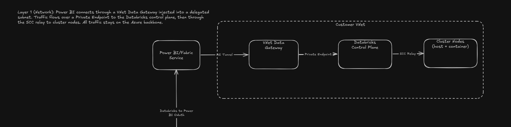
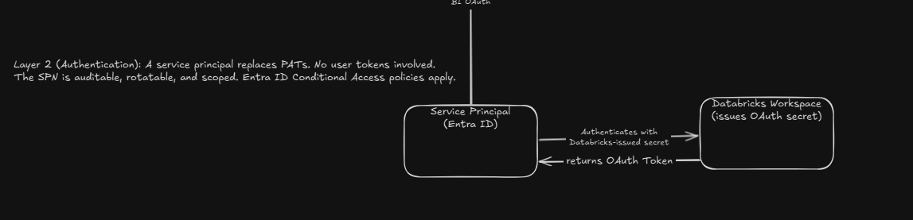
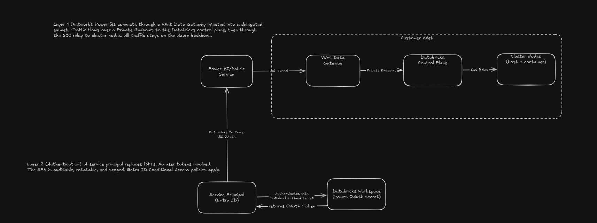
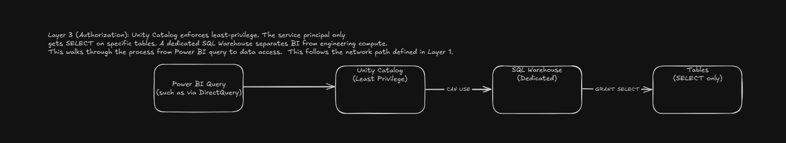

####  Login to Databricks CLI
```
databricks auth login --host https://<your-workspace-url>
databricks auth login --host https://adb-7405616981398218.18.azuredatabricks.net/
```

#### View Databricks ip access lists
```
databricks ip-access-lists list
```

#### If for whatever reason it shows none, but you're sure you have IP access lists, it could be an issue with authentication, so try this
#### use the azure-cli for auth type for this session
```
$env:DATABRICKS_AUTH_TYPE = "azure-cli"
```
#### create another environment variable for the session for the Databricks Host
```
$env:DATABRICKS_HOST = "https://adb-7405616981398218.18.azuredatabricks.net"
```

#### Now view the ip access lists

```powershell
databricks ip-access-lists list --output json
```

> **Output:**
> ```json
> [
>   {
>     "address_count": 2,
>     "created_at": 1771870325695,
>     "created_by": 7010126945553087,
>     "enabled": true,
>     "ip_addresses": [
>       "172.177.78.102/32",
>       "24.218.99.135/32"
>     ],
>     "label": "Approved Networks",
>     "list_id": "b1532f72-77c5-44ab-aa9f-f338635e1aa3",
>     "list_type": "ALLOW",
>     "updated_at": 1771870325695,
>     "updated_by": 7010126945553087
>   }
> ]
> ```

For mine, the 172. is my NAT gateway IP, which is the IP range that controls all outbound traffic from my VNet cluster nodes to the internet (outbound)
Without this, my Databricks cluster nodes couldn't talk back to the control plan via the secure cluster connectivity relay and clusters would fail to start

The 24. is my current public IP (so that I can connect to Databricks).  This should be replaced with your corporate VPN ranges (there may be several).

These are both /32 because in each case, it is just one IP address


#### If you want to add the Power BI IPs to you IP access list
Run this:
arguments:
-IncludePowerBI:  This includees adding Power BI IPs to the access control list for Power BI to connect to Databricks over public internet
-PowerBIRegion:  This is the region to include for Power BI since there is an upper limit of 100 IP ranges that can be added to Databricks access lists.  This should be the location where your Fabric capacity is
-AzureLocation:  This is the region where your Databricks workspace is.
Example:
.\iac\configure-ip-access-list.ps1 -Action Enable -IncludePowerBI -PowerBIRegion "EastUS" -AzureLocation "eastus"

```
Output:
[
  {
    "address_count": 12,
    "created_at": 1771878888513,
    "created_by": 7010126945553087,
    "enabled": true,
    "ip_addresses": [
      "172.177.78.102/32",
      "172.182.152.168/29",
      "172.182.174.208/28",
      "172.182.174.224/28",
      "20.125.157.32/31",
      "20.14.120.8/29",
      "20.14.121.160/29",
      "20.14.121.184/29",
      "20.150.160.110/31",
      "20.150.160.124/30",
      "20.150.161.144/29",
      "24.218.99.135/32"
    ],
    "label": "Approved Networks",
    "list_id": "56818abf-5511-404e-b2a0-8179c1f7f32f",
    "list_type": "ALLOW",
    "updated_at": 1771878888513,
    "updated_by": 7010126945553087
  }
]
```

Note that this isn't the best long term approach because Microsoft adds servers and therefore IPs continuously.  Unfortunately, service tags cannot be used on ip access lists in Databricks.
Therefore, from a security and connectivity the approach, the below pattern is recommended

## The most secure architecture for Power BI -> Databricks Connectivity

#### Layer 1:  Network



Recommendation:  Private Link + VNet Data Gateway
Rationale:  In the default implementation, Power BI connects to Databricks via the Databricks workspace public control plane URL at abd*-.azuredatabricks.net
If this is made privately accessible, and give Power BI a private path to it, the data never leaves Microsoft's back end

Step 1a:  Enable Front-End Private Link on Databricks
This creates a private endpoint fro the Databricks control plane inside your VNet, so that no one can reach the workspace from the public internet

Before network flow:  Power BI -> public internet -> adb-*.azuredatabricks.net (resolves via Public IP because this is a public DNS)

Example:
C:\Users\rharrington>nslookup adb-7405616981398218.18.azuredatabricks.net
Server:  UnKnown
Address:  192.168.1.1

Non-authoritative answer:
Name:    eastus2-c3.azuredatabricks.net
Address:  52.254.24.96
Aliases:  adb-7405616981398218.18.azuredatabricks.net


After:
adb-*.azuredatabricks.net -> resolves to private IP in your VNet
public access disabled

This is done via:
- a browser authentication private endpoint (required for SSO over private networks)
- A private DNS zone linked to your VNet
- Setting publicNetworkAccess to Disabled on the workspace


Step 1b:  Deploy a VNet Data Gateway for Power BI
This is a Microsoft-managed gateway that Power BI service uses to connect through your VNet instead of the public internet
Flow:
Power BI Service -> internal Microsoft tunnel (VNet Data Gateway; container injected into a delegated subnet in your VNet) -> private endpoint (Databricks control plan; private IP) -> SCC relay (cluster nodes; your existing host/container subnets)

Steps:
1. Create a delegated subnet in your VNet for Microsoft.PowerPlatform/vnetaccesslinks
2. Register the VNet data gateway in the Power BI Admin Portal -> Manage Connections and Gateways
3. Associate it with your VNet + Subnet
4. Configure the Power BI data souce to use the VNet gateway

Key Benefit:  All traffic stays on the Azure backbone.  NSGs on the gateway subnet apply to Power BI's traffic.  Now your VNet can control Power BI, unlike the public architecture.


 #### Layer 2: Authentication — Service Principal with M2M OAuth (no PATs)



This layer recommends moving away from individual user entra accounts or PAT tokens and moving towards an SPN.  The rationale for this is if an individual user leaves an organization, this will introduce breaking changes to any integrations that are using their credentials.  A PAT token has similar behavior and is something where, if a user gets access to that PAT token, any action they take when logged in as that user will be traced back to the principal that created that PAT token.  This includes if a user who shouldn't have access to objects secured by the PAT token.  

  Step 2a: Create a Service Principal in Entra ID

   1. Go to Entra ID → App registrations → New registration
   2. Name it something like svc-powerbi-databricks
   3. Note the Application (client) ID

  Step 2b: Configure the Service Principal in Databricks

   1. Add the service principal to your Databricks workspace: Admin Settings → Service principals → Add
   2. Generate an OAuth secret for it in Databricks (Settings → Identity and access → Service principals → Secrets → Generate secret)
   3. Grant it CAN USE on your SQL Warehouse
   4. Grant it SELECT on only the specific tables Power BI needs (see Layer 3)

  Step 2c: Configure Power BI to Use M2M OAuth (Machine To Machine OAuth)

  In Power BI Service → Manage connections and gateways → your VNet gateway connection:

   - Authentication method: Databricks Client Credentials
   - Client ID: the service principal's application ID
   - Client Secret: the OAuth secret from Step 2b

   Key benefit: No user tokens involved. The service principal is auditable, rotatable, and scoped to exactly what Power BI needs.

   ##### Layers 1 and 2
   

  -------------------------------------------------------------------------------------------------------------------------------------------------------------------------------------------------------------------------------------------------------------------------------------------------------   

  #### Layer 3: Authorization — Unity Catalog with Least-Privilege Access



  Don't give Power BI access to everything. Use Unity Catalog to restrict the service principal to only the data it needs.

  Step 3a: Grant Minimal Permissions

   -- Only allow SELECT on the specific tables Power BI reports use
   GRANT USE CATALOG ON CATALOG demo TO `service-principal-created-above`;
   GRANT USE SCHEMA ON SCHEMA demo.reporting TO `service-principal-created-above`;
   GRANT SELECT ON TABLE demo.reporting.sample_table TO `service-principal-created-above`;

   -- Do NOT grant broader permissions like:
   -- GRANT SELECT ON SCHEMA demo.* TO ...  (too broad)

  Step 3b: Use a Dedicated SQL Warehouse

  Don't let Power BI share an all-purpose cluster. Use a SQL Warehouse dedicated to BI workloads:

   - Better governance (who's querying what)
   - Auto-scales and auto-stops (cost control)
   - Can enforce query timeouts
   - Separate compute from data engineering workloads

  -------------------------------------------------------------------------------------------------------------------------------------------------------------------------------------------------------------------------------------------------------------------------------------------------------   

  #### Layer 4: Defense in Depth — Additional Controls

  These are optional but recommended for maximum security:

  | Control | What it adds |
  |---|---|
  | IP Access Lists (what you already have) | Even with Private Link, keep these as a backup — if someone accidentally re-enables public access, the IP list still blocks unauthorized IPs |
  | Entra ID Conditional Access | Apply policies to the service principal — e.g., only allow authentication from specific networks or require compliant devices |
  | Diagnostic Logging | Enable Databricks audit logs → send to Log Analytics. Track every query the service principal runs |
  | Workspace-level firewall (storage) | If firewall is enabled on your workspace storage account, the VNet data gateway handles this automatically |

  -------------------------------------------------------------------------------------------------------------------------------------------------------------------------------------------------------------------------------------------------------------------------------------------------------   

  Summary: Current State vs. Most Secure State

  | Aspect | Your Current Setup | Most Secure |
  |---|---|---|
  | Network path | Public internet → public control plane | VNet Data Gateway → Private Endpoint → control plane (no public exposure) |
  | Workspace access | Public + IP access lists | Private Link only (publicNetworkAccess: Disabled) |
  | Authentication | PAT or user OAuth | Service Principal with M2M OAuth |
  | Authorization | Full workspace access | Unity Catalog — SELECT on specific tables only |
  | Compute | Shared cluster | Dedicated SQL Warehouse |
  | Auditability | Limited | Full audit logs + Entra ID sign-in logs |

  -------------------------------------------------------------------------------------------------------------------------------------------------------------------------------------------------------------------------------------------------------------------------------------------------------   

  Implementation Order

   1. Service Principal + M2M OAuth (Layer 2) 
   2. Unity Catalog least-privilege grants (Layer 3)
   3. Dedicated SQL Warehouse (Layer 3b)
   4. Private Link on Databricks (Layer 1a)
   5. VNet Data Gateway (Layer 1b) 
   6. Disable public access 


  What's NOT in Bicep (requires manual setup)

   - Layer 2: Service Principal registration (Entra ID) + Databricks OAuth secret
   - Layer 1b: VNet Data Gateway registration (Power BI Admin Portal)
   - Layer 3: Unity Catalog grants + dedicated SQL Warehouse
   - Layer 4: Entra ID Conditional Access policies